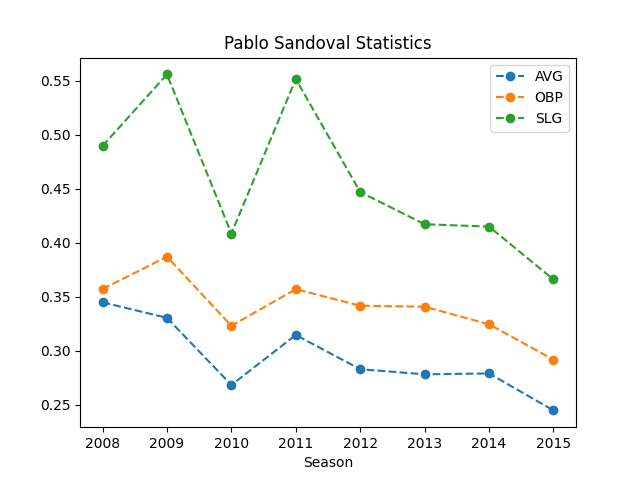
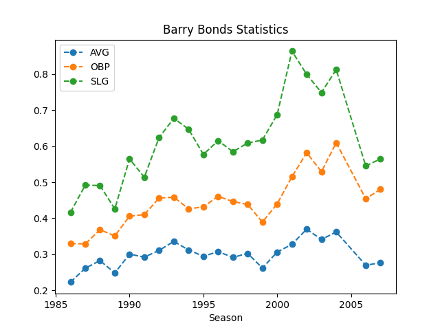

# Overview

[Video Explanation](http://youtube.link.goes.here)

## The Program Objectives

The questions I aim to answer with this dataset are:
- How have league-wide batting statistics (such as AVG, OBP, and SLG) changed over the history of the MLB (from 1871 to 2015)?
- How have the same batting statistics changed over a given player's individual career?
- Based on a set of features for a given player (past batting data, age, etc.), and given the number of at bats in a season, what is a predicted batting average (AVG)?

## The Dataset

The data analyzed by this program is [The Baseball Databank](https://www.kaggle.com/datasets/open-source-sports/baseball-databank) which is data on baseball players, teams, and games from 1871 to 2015. 

This dataset has four main tables: **Master** (player names, DOB, and biographical info), **Batting** (batting statistics), **Pitching** (pitching statistics), and **Fielding** (fielding statistics). 

In this program we utilize the **Master**  and **Batting** tables.
```python
import pandas as pd

# Convert csv files into Pandas DataFrames
batting_data = pd.read_csv(r"data\\Batting.csv")
master_data = pd.read_csv(r"data\\Master.csv")
```

The **Master** table has 18,846 rows and contains information about individual players. The table looks like this:
|playerID|birthYear|birthMonth|...|nameFirst|nameLast|weight|height|bats|
|-|-|-|-|-|-|-|-|-|
|bondsba01|1964|7|...|Barry|Bonds|185|73|L|
|ordonma01|1974|1|...|Magglio|Ordonez|215|72|R|
|palmera01|1964|9|...|Rafael|Palmeiro|180|72|L|

The **Batting** table has 101,332 rows and contains batting data for individual players in a year. The table looks like this:
|playerID|yearID|...|AB|H|2B|3B|...|BB|
|-|-|-|-|-|-|-|-|-|
|bondsba|1995|...|506|149|30|7|...|120|
|bondsba|1996|...|517|159|27|3|...|151|
|ordonma01|2004|...|202|59|8|2|...|16|
|palmera01|2004|...|550|142|29|0|...|86|

For this data to be useful, the Batting Table and Master Table are joined with `playerID` as the key index and the desired columns are specified.
```python
# Join two tables with the playerID as the index
d.merge(master_data, \
         batting_data, \
         on=["playerID"]) \
         [["playerID", "nameLast", "nameFirst", "birthYear", "yearID", "AB", "H", "2B", "3B", "HR", "BB", "HBP", "SO", "SF"]] \
         .sort_values(by=["yearID", "nameLast", "nameFirst"])
``````
The resulting table includes all the rows in the **Batting** table but columns with player information from the **Master** table are added:
|playerID|nameLast|nameFirst|yearID|AB|H|2B|...|BB|
|-|-|-|-|-|-|-|-|-|
|bondsba01| Bonds| Barry| 1995| 506| 149| 30| ...| 120|
|bondsba01| Bonds| Barry| 1996| 517| 159| 27| ...| 151|
|ordonma01| Ordonez| Magglio| 2004| 202| 59| 8| ...| 16|
|palmera01| Rafael| Palmeiro| 2004| 550| 142| 29|...| 86|

# Data Analysis Results

The `BattingDataDisplay` class handles printing and displaying tables and graphs for different subsets of the data. All images and tables in this section are generated in this way.

## How have league-wide batting statistics (such as AVG, OBP, and SLG) changed over the history of the MLB (from 1871 to 2015)?
We can identify trends in league-wide batting statistics over a period of almost 150 years with the following graph:


This graph is generated with the following method:
```python
def graph_league_batting_statistics(self):
    league_data = self.batting_data.statistics_for_league()
    league_data.plot(marker="none")
    plt.title("MLB League Statistics 1871-2015")
    plt.xlabel("Season")
    plt.show()
```

## How have the same batting statistics changed over a given player's individual career?
Just as with league statistics, given a playerID we can graph a player's statistics over his career. These graphs show trends and changes in a player's batting statistics over his individual career:





These graphs are generated with the following method given the playerID of any of the 18,000+ players in the dataset:
```python
def graph_player_batting_statistics(self, player_id):
    player_data = self.batting_data.statistics_for_player(player_id)
    player_data.plot(marker="o", linestyle="dashed")
    plt.title(f"{self.batting_data.name_for_player(player_id)} Statistics")
    plt.xlabel("Season")
    plt.show()
```

## Based on a set of features for a given player (past batting data, age, etc.), and given the number of at bats in a season, what is a predicted batting average (AVG)?

### The Predictive Model

Firstly, a predictive model that uses a machine learning algorithm called Extreme Gradient Boosting is implemented using the `xgboost` library. This algorithm is a optimized and more complex version of the decision tree machine learning algorithm.

```python
from xgboost import XGBRegressor

gradient_model = XGBRegressor(random_state=0, n_estimators=500, learning_rate=0.04)
```

With the model generated. We use the `for_predict_model()` method of the `BattingData` class to generate a table that looks like this:

| yearID | playerID | nameLast | nameFirst | age | AB | AVG | careerAVG 
|-----|-----|-----|-----|-----|-----|-----|-----|
2015|zimmery01|Zimmerman|Ryan|31.0|346.0|0.248555|0.284188
1988|phelpke01|Phelps|Ken|34.0|190.0|0.284211|0.244003
2004|kotsama01|Kotsay|Mark|29.0|606.0|0.313531|0.282828

This is the data which we will use to fit the predictive model.

As can be seen, this method creates new columns such as `careerAVG` and `age` based on other data in the tables. This is called **feature engineering**; it is key to getting more accurate predictions. By engineering these features we are giving the predictive model more information to make decisions based off of.

The following code seperates the data into the **Prediction Target** `y` and the **Features** `X`. The **features** are the columns that the predictive model will use to predict the **target**. 
```python
# Create x and y sets
batting_data = BattingData()
X = batting_data.for_predict_model().query(f"yearID != {year}")[["age", "AB", "AVG", "careerAVG"]]
X.dropna(axis=0, subset=["AVG"], inplace=True)
y = X['AVG']
X.drop(['AVG'], axis=1, inplace=True)

# Fit the model to the data
gradient_model.fit(X, y)
```

With the model generated we can make our predictions based on a random sample of playerIDs from 2015: `['morelmi01', 'beckhti01',  'swihabl01', 'gomezca01', 'crawfbr01', 'gardnbr01']`

```python
# Generate predictions with the model
predictions = pd.Series(gradient_model.predict(batting_data_year[["age", "AB", "careerAVG"]]))
```

This table compares the results of the predictive model with the actual batting averages for each player in 2015 

playerID  | nameFirst |  nameLast |  real_AVG |  predicted_AVG
----------|-----------|-----------|-----------|---------------
beckhti01 |       Tim |   Beckham |  0.221675 |       0.246462
crawfbr01 |   Brandon |  Crawford |  0.256410 |       0.257204
gardnbr01 |     Brett |   Gardner |  0.259194 |       0.272702
gomezca01 |    Carlos |     Gomez |  0.262238 |       0.252414
gomezca01 |    Carlos |     Gomez |  0.241611 |       0.244528
morelmi01 |     Mitch |  Moreland |  0.278132 |       0.255698
swihabl01 |     Blake |   Swihart |  0.274306 |       0.253211

### Testing the Predictive Model

We can test the predictive model by randomly splitting the original data in two groups: *test* and *validation*. This is done using the `sklearn` library:

```python
from sklearn.model_selection import train_test_split

# Split data into training and validation sets
X_train, X_valid, y_train, y_valid = train_test_split(X, y, train_size=0.8, test_size=0.2, random_state=0)
```

Then, we implement the model with training data only and test it with the validation data:

```python
gradient_model.fit(X_train, y_train)

# Generate predictions with the model
predictions = pd.Series(gradient_model.predict(X_valid))
```

Lastly, we can check these predictions with the validation target data and get the **mean Absolute Error** of the predictive model's predictions:

```python
# Return mean absolute error for predictions
mean_absolute_error = mean_absolute_error(y_valid, predictions)
```

The **Mean Absolute Error** for this predictive model was measured at **`0.02592`**. This, in the context of this program, means that *on average*, the model's prediction for a player's batting average differs from the actual batting average by 0.02592. Not bad :-)

# Development

This program was developed using **Visual Studio Code** and **Python 3.11.3**.

The following Python libraries were used:
- pandas
- sklearn
- matplotlib

# Useful Resources

- [Kaggle](http://url.link.goes.here)

# Future Work

This project was an excercise in **writing software** to analyze complex and large datasets. I am not a data scientist and therefore many improvements in the *methods* of analyzing this data are possible, such as:

* Better feature engineering.
* Improvements in how league-wide statistical data is shown over time.

In terms of the software itself, there are many improvements and additions that could be made:

* A UI to interact with the data and the way in which it is displayed.