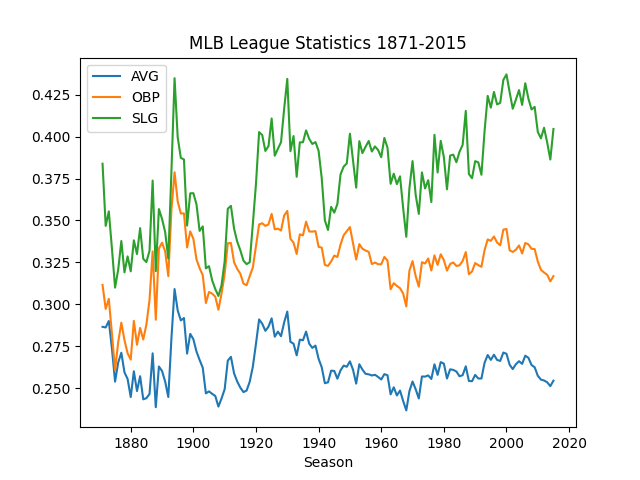

# Overview

[Video Explanation](http://youtube.link.goes.here)

## The Dataset

The data analyzed by this program is [The Baseball Databank](https://www.kaggle.com/datasets/open-source-sports/baseball-databank) which is data on baseball players, teams, and games from 1871 to 2015. 

This dataset has four main tables: **Master** (player names, DOB, and biographical info), **Batting** (batting statistics), **Pitching** (pitching statistics), and **Fielding** (fielding statistics). 

In this program we utilize the **Master**  and **Batting** tables.
```python
# Convert csv files into Pandas DataFrames
batting_data = pd.read_csv(r"data\\Batting.csv")
master_data = pd.read_csv(r"data\\Master.csv")
```

The **Master** table has 18,846 rows and contains information about individual players. The table looks like this:
|playerID|birthYear|birthMonth|...|nameFirst|nameLast|weight|height|bats|
|-|-|-|-|-|-|-|-|-|
|bondsba01|1964|7|...|Barry|Bonds|185|73|L|
|ordonma01|1974|1|...|Magglio|Ordonez|215|72|R|
|palmera01|1964|9|...|Rafael|Palmeiro|180|72|L|

The **Batting** table has 101,332 rows and contains batting data for individual players in a year. The table looks like this:
|playerID|yearID|...|AB|H|2B|3B|...|BB|
|-|-|-|-|-|-|-|-|-|
|bondsba|1995|...|506|149|30|7|...|120|
|bondsba|1996|...|517|159|27|3|...|151|
|ordonma01|2004|...|202|59|8|2|...|16|
|palmera01|2004|...|550|142|29|0|...|86|

For this data to be useful, the Batting Table and Master Table are joined with `playerID` as the key index and the desired columns are specified.
```python
import pandas as pd

# Join two tables with the playerID as the index
d.merge(master_data, \
         batting_data, \
         on=["playerID"]) \
         [["playerID", "nameLast", "nameFirst", "birthYear", "yearID", "AB", "H", "2B", "3B", "HR", "BB", "HBP", "SO", "SF"]] \
         .sort_values(by=["yearID", "nameLast", "nameFirst"])
``````
The resulting table includes all the rows in the **Batting** table but columns with player information from the **Master** table are added:
|playerID|nameLast|nameFirst|yearID|AB|H|2B|...|BB|
|-|-|-|-|-|-|-|-|-|
|bondsba01| Bonds| Barry| 1995| 506| 149| 30| ...| 120|
|bondsba01| Bonds| Barry| 1996| 517| 159| 27| ...| 151|
|ordonma01| Ordonez| Magglio| 2004| 202| 59| 8| ...| 16|
|palmera01| Rafael| Palmeiro| 2004| 550| 142| 29|...| 86|

## The Program Objectives

The questions I aim to answer with this dataset are:
- How have league-wide batting statistics (such as AVG, OBP, and SLG) changed over the history of the MLB (from 1871 to 2015)?
- How have the same batting statistics changed over a given player's individual career?
- Based on a set of features for a given player (past batting data, age, etc.), and given the number of at bats in a season, what is a predicted batting average (AVG)?

# Data Analysis Results

The `BattingDataDisplay` class handles printing and displaying tables and graphs for different subsets of the data. All images and tables in this section are generated in this way.

## How have league-wide batting statistics (such as AVG, OBP, and SLG) changed over the history of the MLB (from 1871 to 2015)?
We can identify trends in league-wide batting statistics over a period of almost 150 years with the following graph:



This graph is generated with the following method:
```python
def graph_league_batting_statistics(self):
    league_data = self.batting_data.statistics_for_league()
    league_data.plot(marker="none")
    plt.title("MLB League Statistics 1871-2015")
    plt.xlabel("Season")
    plt.show()
```

## How have the same batting statistics changed over a given player's individual career?

With the player

# Development

This program was developed using **Visual Studio Code** and **Python 3.11.3**.

The following Python libraries were used:
- Pandas
- sklearn
- matplotlib

# Useful Resources

- [Kaggle](http://url.link.goes.here)

# Future Work

This project was an excercise in **writing software** to analyze complex and large datasets. I am not a data scientist and therefore many improvements in the *methods* of analyzing this data are possible, such as:

* Better feature engineering.
* Improvements in how league-wide statistical data is shown over time.

In terms of the software itself, there are many improvements and additions that could be made:

* A UI to interact with the data and the way in which it is displayed.